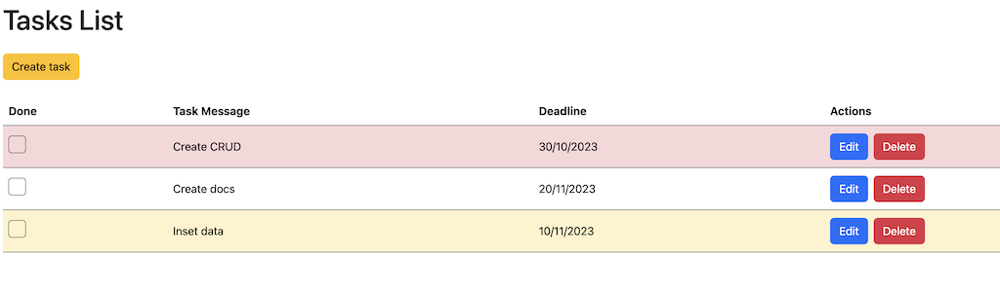
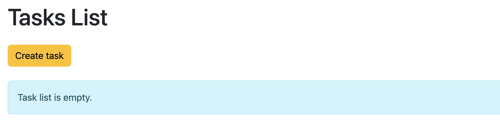
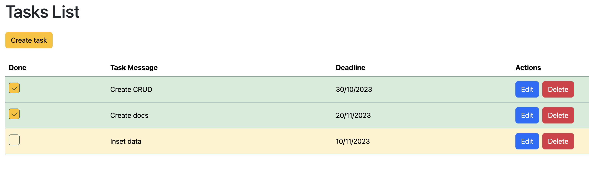
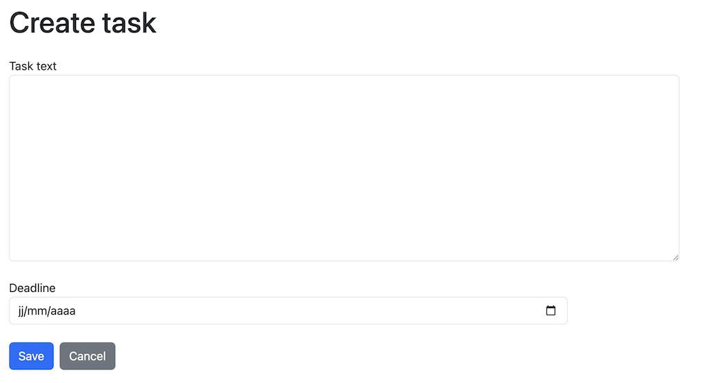
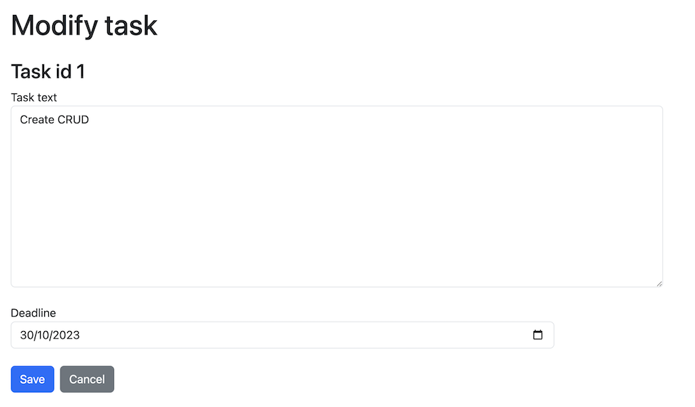

# Le projet pédagogique : "TODO LIST"

## Les caractéristiques

- une liste de tâches ;
- la création de tâches ;
- la modification de tâches ;
- la suppression de tâches ;
- des differents alertes pour chaque action.

## Utilisation

Afin d'exécuter ce projet localement il faut :

- installer toutes les dependances à la racine du projet

```bash
    npm install
```

- démarrer le serveur

```bash
    ng serve
```

## La Stack Technique

**Client :** Angular, HTML5, CSS3

## Screenshots
### --------------------- Une liste de tâches / Tasks list ---------------------

### --------------------- Une liste vide / No tasks ---------------------

### --------------------- Une liste de tâches avec des tâches fini / Tasks list with finished tasks ---------------------

### --------------------- Creation de tâche / Create task ---------------------

### --------------------- Modification de tâche / Modify task ---------------------



### --------------------- English version ---------------------

# The educational project: “TODO LIST”

## Characteristics

- a to-do list;
- the creation of tasks;
- modification of tasks;
- the deletion of tasks;
- different alerts for each action.

## Use

In order to execute this project locally you must:

- install all dependencies at the root of the project

```bash
     npm install
```

- start the server

```bash
     ng serve
```

## Tech Stack

**Client:** Angular, HTML5, CSS3